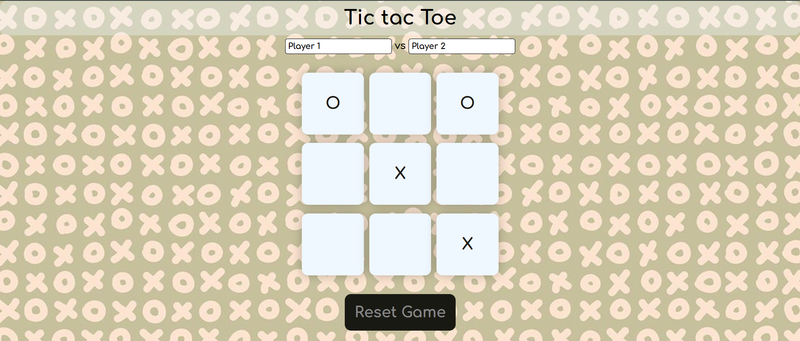

# Tic Tac Toe Game

A simple Tic Tac Toe game built using HTML, CSS, and JavaScript. It allows two players to play against each other in a browser. Players can enter their names, take turns marking "X" or "O" on the grid, and the game will display the winner when someone wins. 

### Features
- Players can enter their names.
- The game alternates between Player 1 ("X") and Player 2 ("O").
- A winner is declared when a player has three of their marks in a row (horizontally, vertically, or diagonally).
- Players can reset the game or start a new game after a winner is declared.

### Project Structure
The project consists of the following files:
- **index.html**: The main HTML structure of the game.
- **styles.css**: The CSS styles that define the layout and appearance of the game.
- **script.js**: JavaScript code that handles the game logic and user interaction.

### Prerequisites
This project doesn't have any external dependencies, and no server is required. It only uses standard web technologies such as:
- HTML5
- CSS3
- JavaScript (ES6+)

### How to Play
1. Open the `index.html` file in your browser.
2. Enter the names of Player 1 and Player 2 in the input fields.
3. Click on the game grid to place either an "X" or "O" based on your turn.
4. The game alternates turns between Player 1 and Player 2.
5. If a player wins, a message will appear with the winner's name.
6. Click on the "New Game" button to reset the game and play again.

### Game Logic
- The grid is made up of 9 buttons arranged in a 3x3 grid.
- Each button represents a cell where players place their marks ("X" or "O").
- The game checks for a winner after each turn by checking the predefined winning patterns.
- If a player achieves one of the winning patterns, they are declared the winner.

### How to Run
1. Clone or download this repository.
2. Open the `index.html` file in your web browser.
3. Enjoy the game!

### Screenshots
 *(Add a screenshot image to the repository if desired)*

### License
This project is open source and available under the [MIT License](LICENSE).

